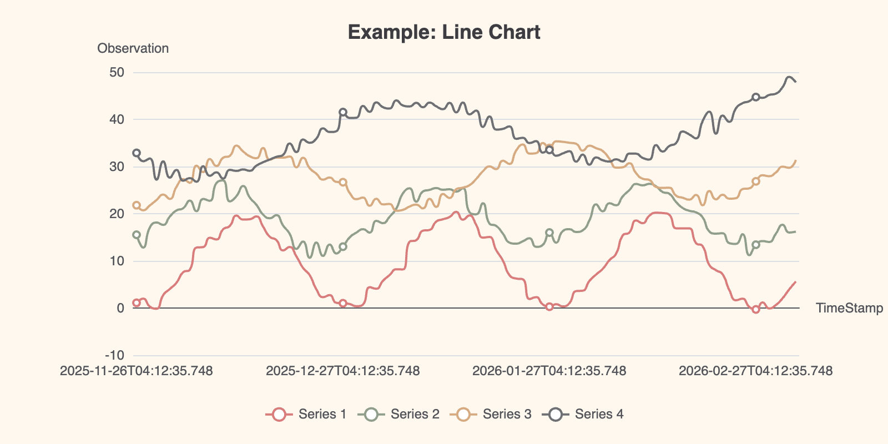

# EChartsLight.jl

A light-weight Julia wrapper for [Apache ECharts](https://echarts.apache.org/en/index.html). Heavily inspired by [PlotlyLight.jl](https://github.com/JuliaComputing/PlotlyLight.jl)



## Features

- **Simple API**: Create interactive charts with minimal boilerplate
- **ECharts Configuration**: Direct access to ECharts options through Julia's `Config` objects
- **Multiple Environments**: Works in Jupyter notebooks, Pluto, VS Code, and Quarto documents
- **Flexible Rendering**: Choose between SVG and Canvas renderers

## Quick Start

```julia
using EChartsLight

# Create a simple line chart

ec = EChart()
ec.config.title.text = "My First Chart"
ec.config.xAxis = Config(type="category", data=["Mon", "Tue", "Wed", "Thu", "Fri"])
ec.config.yAxis = Config(type="value")
ec.config.series = [Config(type="line", data=[150, 230, 224, 218, 135])]

# Display the chart
# depending upon your environment you may
# have to use `preview(ec)`
ec  
```

## Basic Usage

### Creating Charts

The main type is `EChart`, which has three key fields:

- `config`: ECharts option configuration (chart data, axes, series, etc.)
- `options`: Rendering options (width, height, renderer, theme)
- `jsurl`: URL to the ECharts JavaScript library

```julia
# Create an EChart with custom dimensions and theme
ec = EChart()
ec.options.width = "600px"
ec.options.height = "400px"
ec.options.theme = "vintage"
ec.options.renderer = "canvas"  # or "svg"
```

### Using Config Objects

The `Config` object (from EasyConfig.jl) allows you to set ECharts options using Julia syntax:

```julia
ec.config.title = Config(text="Sales Data", subtext="Q4 2025")
ec.config.legend.show = true
ec.config.tooltip.show = true
```

### Multiple Series

```julia
ec = EChart()
ec.config.xAxis = Config(type="category", data=["A", "B", "C"])
ec.config.yAxis = Config(type="value")
ec.config.series = [
    Config(type="bar", data=[10, 20, 30], name="Series 1"),
    Config(type="bar", data=[15, 25, 35], name="Series 2")
]
ec.config.legend.show = true
```

## Core Dependencies

- EasyConfig.jl: Configuration object handling
- Cobweb.jl: HTML generation
- JSON3.jl: JSON serialization
